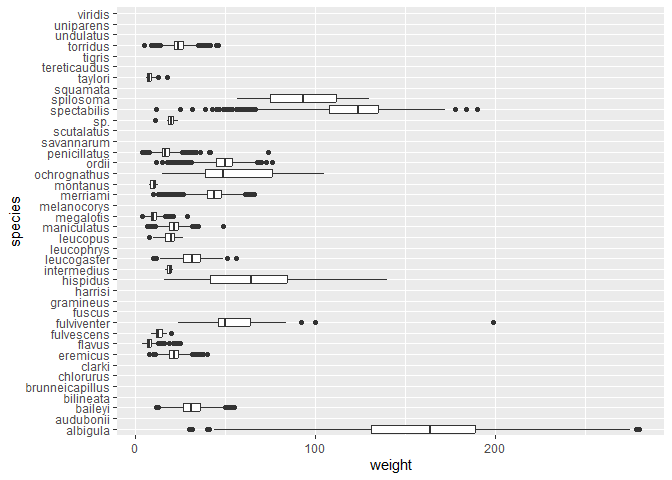
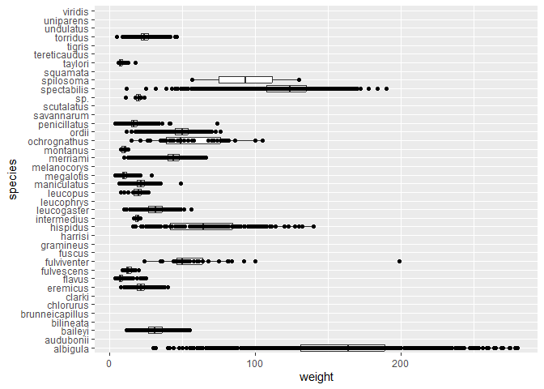
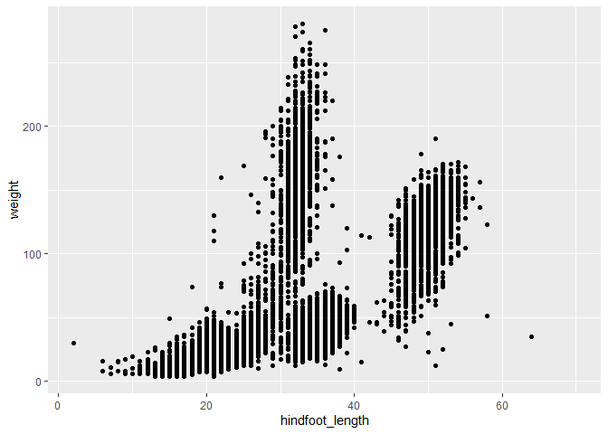
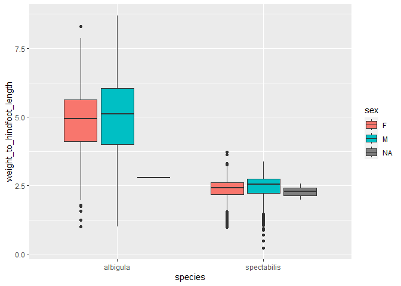
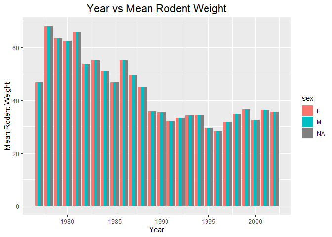

## Instructions
Answer the following questions and complete the exercises in RMarkdown. Please embed all of your code and push your final work to your repository. Your final lab report should be organized, clean, and run free from errors. Remember, you must remove the `#` for the included code chunks to run. Be sure to add your name to the author header above. For any included plots, make sure they are clearly labeled. You are free to use any plot type that you feel best communicates the results of your analysis.  

Make sure to use the formatting conventions of RMarkdown to make your report neat and clean!  

## Load the libraries

```r
library(tidyverse)
library(janitor)
library(here)
library(naniar)
```

## Desert Ecology
For this assignment, we are going to use a modified data set on [desert ecology](http://esapubs.org/archive/ecol/E090/118/). The data are from: S. K. Morgan Ernest, Thomas J. Valone, and James H. Brown. 2009. Long-term monitoring and experimental manipulation of a Chihuahuan Desert ecosystem near Portal, Arizona, USA. Ecology 90:1708.

```r
deserts <- read_csv(here("lab10", "data", "surveys_complete.csv"))
```

```
## Rows: 34786 Columns: 13
## ── Column specification ────────────────────────────────────────────────────────
## Delimiter: ","
## chr (6): species_id, sex, genus, species, taxa, plot_type
## dbl (7): record_id, month, day, year, plot_id, hindfoot_length, weight
## 
## ℹ Use `spec()` to retrieve the full column specification for this data.
## ℹ Specify the column types or set `show_col_types = FALSE` to quiet this message.
```

1. Use the function(s) of your choice to get an idea of its structure, including how NA's are treated. Are the data tidy? 

```r
glimpse(deserts)
```

```
## Rows: 34,786
## Columns: 13
## $ record_id       <dbl> 1, 2, 3, 4, 5, 6, 7, 8, 9, 10, 11, 12, 13, 14, 15, 16,…
## $ month           <dbl> 7, 7, 7, 7, 7, 7, 7, 7, 7, 7, 7, 7, 7, 7, 7, 7, 7, 7, …
## $ day             <dbl> 16, 16, 16, 16, 16, 16, 16, 16, 16, 16, 16, 16, 16, 16…
## $ year            <dbl> 1977, 1977, 1977, 1977, 1977, 1977, 1977, 1977, 1977, …
## $ plot_id         <dbl> 2, 3, 2, 7, 3, 1, 2, 1, 1, 6, 5, 7, 3, 8, 6, 4, 3, 2, …
## $ species_id      <chr> "NL", "NL", "DM", "DM", "DM", "PF", "PE", "DM", "DM", …
## $ sex             <chr> "M", "M", "F", "M", "M", "M", "F", "M", "F", "F", "F",…
## $ hindfoot_length <dbl> 32, 33, 37, 36, 35, 14, NA, 37, 34, 20, 53, 38, 35, NA…
## $ weight          <dbl> NA, NA, NA, NA, NA, NA, NA, NA, NA, NA, NA, NA, NA, NA…
## $ genus           <chr> "Neotoma", "Neotoma", "Dipodomys", "Dipodomys", "Dipod…
## $ species         <chr> "albigula", "albigula", "merriami", "merriami", "merri…
## $ taxa            <chr> "Rodent", "Rodent", "Rodent", "Rodent", "Rodent", "Rod…
## $ plot_type       <chr> "Control", "Long-term Krat Exclosure", "Control", "Rod…
```

```r
#The NAs are being treated as missing data. It makes sense because the species, ids, and dates are all known, but the data observations may be hard to get or just missing.
naniar::miss_var_summary(deserts)
```

```
## # A tibble: 13 × 3
##    variable        n_miss pct_miss
##    <chr>            <int>    <dbl>
##  1 hindfoot_length   3348     9.62
##  2 weight            2503     7.20
##  3 sex               1748     5.03
##  4 record_id            0     0   
##  5 month                0     0   
##  6 day                  0     0   
##  7 year                 0     0   
##  8 plot_id              0     0   
##  9 species_id           0     0   
## 10 genus                0     0   
## 11 species              0     0   
## 12 taxa                 0     0   
## 13 plot_type            0     0
```

```r
#I think that the data is tidy overall. There are no weird values and the rows, columns, and cells all fit the tidy criteria.
deserts <- clean_names(deserts)
deserts
```

```
## # A tibble: 34,786 × 13
##    record…¹ month   day  year plot_id speci…² sex   hindf…³ weight genus species
##       <dbl> <dbl> <dbl> <dbl>   <dbl> <chr>   <chr>   <dbl>  <dbl> <chr> <chr>  
##  1        1     7    16  1977       2 NL      M          32     NA Neot… albigu…
##  2        2     7    16  1977       3 NL      M          33     NA Neot… albigu…
##  3        3     7    16  1977       2 DM      F          37     NA Dipo… merria…
##  4        4     7    16  1977       7 DM      M          36     NA Dipo… merria…
##  5        5     7    16  1977       3 DM      M          35     NA Dipo… merria…
##  6        6     7    16  1977       1 PF      M          14     NA Pero… flavus 
##  7        7     7    16  1977       2 PE      F          NA     NA Pero… eremic…
##  8        8     7    16  1977       1 DM      M          37     NA Dipo… merria…
##  9        9     7    16  1977       1 DM      F          34     NA Dipo… merria…
## 10       10     7    16  1977       6 PF      F          20     NA Pero… flavus 
## # … with 34,776 more rows, 2 more variables: taxa <chr>, plot_type <chr>, and
## #   abbreviated variable names ¹​record_id, ²​species_id, ³​hindfoot_length
```

2. How many genera and species are represented in the data? What are the total number of observations? Which species is most/ least frequently sampled in the study?

```r
#According to the data, there are 34786 observations. (look in environment panel)
deserts %>% 
  count(genus, sort = T)
```

```
## # A tibble: 26 × 2
##    genus                n
##    <chr>            <int>
##  1 Dipodomys        16167
##  2 Chaetodipus       6029
##  3 Onychomys         3267
##  4 Reithrodontomys   2694
##  5 Peromyscus        2234
##  6 Perognathus       1629
##  7 Neotoma           1252
##  8 Ammospermophilus   437
##  9 Amphispiza         303
## 10 Spermophilus       249
## # … with 16 more rows
```

```r
#There are 26 genera.
```

```r
deserts %>% 
  count(species, sort = T)
```

```
## # A tibble: 40 × 2
##    species          n
##    <chr>        <int>
##  1 merriami     10596
##  2 penicillatus  3123
##  3 ordii         3027
##  4 baileyi       2891
##  5 megalotis     2609
##  6 spectabilis   2504
##  7 torridus      2249
##  8 flavus        1597
##  9 eremicus      1299
## 10 albigula      1252
## # … with 30 more rows
```

```r
#There are 40 species, with merriami being the most sampled and clarki, scutalatus, tereticaudus, tigris, uniparens, and virdis being tied for the least sampled.
```

3. What is the proportion of taxa included in this study? Show a table and plot that reflects this count.

```r
deserts %>% 
  count(taxa, sort = T)
```

```
## # A tibble: 4 × 2
##   taxa        n
##   <chr>   <int>
## 1 Rodent  34247
## 2 Bird      450
## 3 Rabbit     75
## 4 Reptile    14
```

```r
#I did did a scale_y_log10 so that the graph wouldn't be so contorted by the rodents.
deserts %>% 
  ggplot(aes(x=taxa))+geom_bar()+scale_y_log10()
```

<!-- -->


4. For the taxa included in the study, use the fill option to show the proportion of individuals sampled by `plot_type.`

```r
deserts %>% 
  ggplot(aes(x=taxa, fill = plot_type))+geom_bar()+scale_y_log10()
```

<!-- -->

5. What is the range of weight for each species included in the study? Remove any observations of weight that are NA so they do not show up in the plot.

```r
deserts %>% 
  group_by(species) %>% 
  top_n(1, weight) %>% 
  select(species, weight) %>% 
  arrange(desc(weight))
```

```
## # A tibble: 26 × 2
## # Groups:   species [22]
##    species      weight
##    <chr>         <dbl>
##  1 albigula        280
##  2 fulviventer     199
##  3 spectabilis     190
##  4 hispidus        140
##  5 spilosoma       130
##  6 ochrognathus    105
##  7 ordii            76
##  8 penicillatus     74
##  9 merriami         66
## 10 leucogaster      56
## # … with 16 more rows
```

```r
deserts %>% 
  group_by(species) %>% 
  top_n(-1, weight) %>% 
  select(species, weight) %>% 
  arrange(desc(weight))
```

```
## # A tibble: 43 × 2
## # Groups:   species [22]
##    species      weight
##    <chr>         <dbl>
##  1 spilosoma        57
##  2 albigula         30
##  3 fulviventer      24
##  4 intermedius      17
##  5 hispidus         16
##  6 ochrognathus     15
##  7 ordii            12
##  8 spectabilis      12
##  9 baileyi          12
## 10 baileyi          12
## # … with 33 more rows
```

```r
deserts %>% 
  ggplot(aes(x=species, y= weight))+
  geom_boxplot(na.rm = T)+
  coord_flip()
```

<!-- -->

6. Add another layer to your answer from #5 using `geom_point` to get an idea of how many measurements were taken for each species.

```r
deserts %>% 
  ggplot(aes(x=species, y= weight))+
  geom_boxplot(na.rm = T)+
  geom_point(na.rm = T)+
  coord_flip()
```

<!-- -->


7. [Dipodomys merriami](https://en.wikipedia.org/wiki/Merriam's_kangaroo_rat) is the most frequently sampled animal in the study. How have the number of observations of this species changed over the years included in the study?\

```r
deserts %>% 
  filter(species == "merriami" & genus == "Dipodomys") %>% 
  count(year)
```

```
## # A tibble: 26 × 2
##     year     n
##    <dbl> <int>
##  1  1977   264
##  2  1978   389
##  3  1979   209
##  4  1980   493
##  5  1981   559
##  6  1982   609
##  7  1983   528
##  8  1984   396
##  9  1985   667
## 10  1986   406
## # … with 16 more rows
```

```r
deserts %>% 
  filter(species == "merriami" & genus == "Dipodomys") %>% 
  ggplot(aes(x=year))+geom_bar()
```

<!-- -->


8. What is the relationship between `weight` and `hindfoot` length? Consider whether or not over plotting is an issue.

```r
#There seems to be a general trend of as hindfood_length increases, the weight increases. It seems to max out a certain value, but the general trend is still there. Over plotting is sort of an issue because so many of these values are overlapping and cluttering up the data.
deserts %>% 
  ggplot(aes(x= hindfoot_length, y= weight))+
  geom_point(na.rm = T)
```

<!-- -->

9. Which two species have, on average, the highest weight? Once you have identified them, make a new column that is a ratio of `weight` to `hindfoot_length`. Make a plot that shows the range of this new ratio and fill by sex.

```r
deserts %>% 
  select(species, weight) %>%
  group_by(species) %>% 
  summarise(weight_mean = mean(weight, na.rm = T)) %>% 
  arrange(desc(weight_mean))
```

```
## # A tibble: 40 × 2
##    species      weight_mean
##    <chr>              <dbl>
##  1 albigula           159. 
##  2 spectabilis        120. 
##  3 spilosoma           93.5
##  4 hispidus            65.6
##  5 fulviventer         58.9
##  6 ochrognathus        55.4
##  7 ordii               48.9
##  8 merriami            43.2
##  9 baileyi             31.7
## 10 leucogaster         31.6
## # … with 30 more rows
```

```r
deserts %>% 
  filter(species ==  "spectabilis" | species == "albigula")  %>% 
  mutate(weight_to_hindfoot_length = weight/hindfoot_length, na.rm = T) %>% 
  ggplot(aes(x=species, y= weight_to_hindfoot_length, fill = sex))+
  geom_boxplot(na.rm=T)
```

<!-- -->


10. Make one plot of your choice! Make sure to include at least two of the aesthetics options you have learned.

```r
deserts %>% 
  filter(taxa == "Rodent") %>% 
  group_by(year) %>% 
  mutate(rodent_mean_weight = mean(weight, na.rm = T)) %>% 
  ggplot(aes(x= year, y= rodent_mean_weight, fill = sex))+geom_col(position = "dodge")+
   labs(title = "Year vs Mean Rodent Weight",
       x = "Year",
       y = "Mean Rodent Weight")+
   theme(plot.title = element_text(size = rel(1.5), hjust = 0.5))
```

<!-- -->

## Push your final code to GitHub!
Please be sure that you check the `keep md` file in the knit preferences. 
