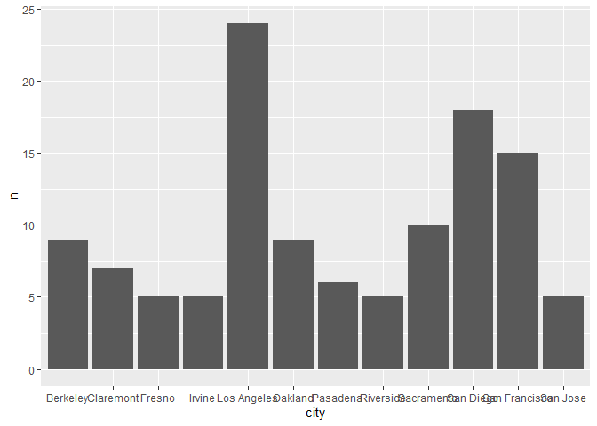
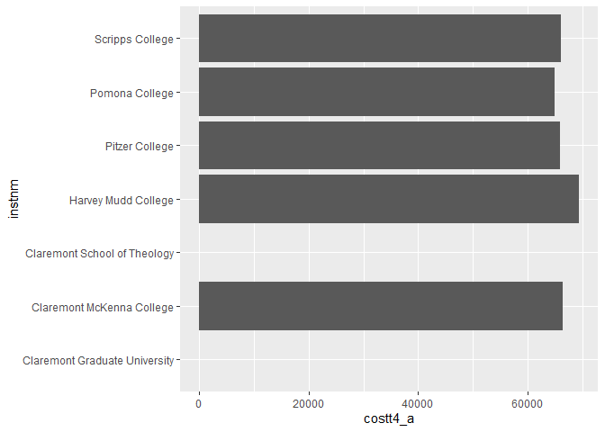
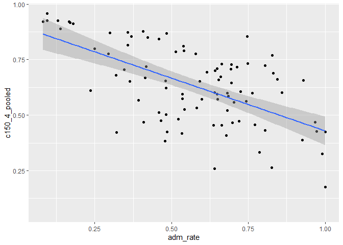
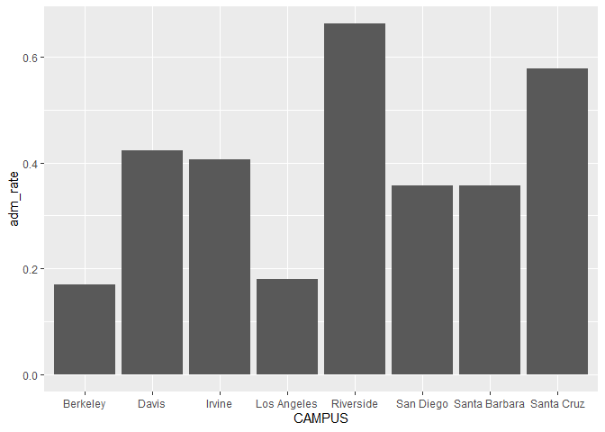
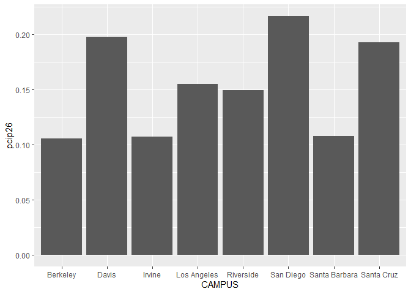

## Instructions
Answer the following questions and complete the exercises in RMarkdown. Please embed all of your code and push your final work to your repository. Your final lab report should be organized, clean, and run free from errors. Remember, you must remove the `#` for the included code chunks to run. Be sure to add your name to the author header above.  

Make sure to use the formatting conventions of RMarkdown to make your report neat and clean!  

## Load the libraries

```r
library(tidyverse)
library(janitor)
library(here)
library(naniar)
```

For this homework, we will take a departure from biological data and use data about California colleges. These data are a subset of the national college scorecard (https://collegescorecard.ed.gov/data/). Load the `ca_college_data.csv` as a new object called `colleges`.

```r
colleges <- readr::read_csv("data/ca_college_data.csv")
```

```
## Rows: 341 Columns: 10
## ── Column specification ────────────────────────────────────────────────────────
## Delimiter: ","
## chr (4): INSTNM, CITY, STABBR, ZIP
## dbl (6): ADM_RATE, SAT_AVG, PCIP26, COSTT4_A, C150_4_POOLED, PFTFTUG1_EF
## 
## ℹ Use `spec()` to retrieve the full column specification for this data.
## ℹ Specify the column types or set `show_col_types = FALSE` to quiet this message.
```

```r
colleges
```

```
## # A tibble: 341 × 10
##    INSTNM      CITY  STABBR ZIP   ADM_R…¹ SAT_AVG PCIP26 COSTT…² C150_…³ PFTFT…⁴
##    <chr>       <chr> <chr>  <chr>   <dbl>   <dbl>  <dbl>   <dbl>   <dbl>   <dbl>
##  1 Grossmont … El C… CA     9202…      NA      NA 0.0016    7956  NA       0.355
##  2 College of… Visa… CA     9327…      NA      NA 0.0066    8109  NA       0.541
##  3 College of… San … CA     9440…      NA      NA 0.0038    8278  NA       0.357
##  4 Ventura Co… Vent… CA     9300…      NA      NA 0.0035    8407  NA       0.382
##  5 Oxnard Col… Oxna… CA     9303…      NA      NA 0.0085    8516  NA       0.275
##  6 Moorpark C… Moor… CA     9302…      NA      NA 0.0151    8577  NA       0.429
##  7 Skyline Co… San … CA     9406…      NA      NA 0         8580   0.233   0.231
##  8 Glendale C… Glen… CA     9120…      NA      NA 0.002     9181  NA       0.421
##  9 Citrus Col… Glen… CA     9174…      NA      NA 0.0021    9281  NA       0.440
## 10 Fresno Cit… Fres… CA     93741      NA      NA 0.0324    9370  NA       0.366
## # … with 331 more rows, and abbreviated variable names ¹​ADM_RATE, ²​COSTT4_A,
## #   ³​C150_4_POOLED, ⁴​PFTFTUG1_EF
```

The variables are a bit hard to decipher, here is a key:  

INSTNM: Institution name  
CITY: California city  
STABBR: Location state  
ZIP: Zip code  
ADM_RATE: Admission rate  
SAT_AVG: SAT average score  
PCIP26: Percentage of degrees awarded in Biological And Biomedical Sciences  
COSTT4_A: Annual cost of attendance  
C150_4_POOLED: 4-year completion rate  
PFTFTUG1_EF: Percentage of undergraduate students who are first-time, full-time degree/certificate-seeking undergraduate students  

1. Use your preferred function(s) to have a look at the data and get an idea of its structure. Make sure you summarize NA's and determine whether or not the data are tidy. You may also consider dealing with any naming issues.

```r
glimpse(colleges)
```

```
## Rows: 341
## Columns: 10
## $ INSTNM        <chr> "Grossmont College", "College of the Sequoias", "College…
## $ CITY          <chr> "El Cajon", "Visalia", "San Mateo", "Ventura", "Oxnard",…
## $ STABBR        <chr> "CA", "CA", "CA", "CA", "CA", "CA", "CA", "CA", "CA", "C…
## $ ZIP           <chr> "92020-1799", "93277-2214", "94402-3784", "93003-3872", …
## $ ADM_RATE      <dbl> NA, NA, NA, NA, NA, NA, NA, NA, NA, NA, NA, NA, NA, NA, …
## $ SAT_AVG       <dbl> NA, NA, NA, NA, NA, NA, NA, NA, NA, NA, NA, NA, NA, NA, …
## $ PCIP26        <dbl> 0.0016, 0.0066, 0.0038, 0.0035, 0.0085, 0.0151, 0.0000, …
## $ COSTT4_A      <dbl> 7956, 8109, 8278, 8407, 8516, 8577, 8580, 9181, 9281, 93…
## $ C150_4_POOLED <dbl> NA, NA, NA, NA, NA, NA, 0.2334, NA, NA, NA, NA, 0.1704, …
## $ PFTFTUG1_EF   <dbl> 0.3546, 0.5413, 0.3567, 0.3824, 0.2753, 0.4286, 0.2307, …
```


```r
colleges <- janitor::clean_names(colleges)
```


```r
naniar::miss_var_summary(colleges)
```

```
## # A tibble: 10 × 3
##    variable      n_miss pct_miss
##    <chr>          <int>    <dbl>
##  1 sat_avg          276     80.9
##  2 adm_rate         240     70.4
##  3 c150_4_pooled    221     64.8
##  4 costt4_a         124     36.4
##  5 pftftug1_ef       53     15.5
##  6 pcip26            35     10.3
##  7 instnm             0      0  
##  8 city               0      0  
##  9 stabbr             0      0  
## 10 zip                0      0
```

```r
#The data is tidy, all the columns are variables. 
```

2. Which cities in California have the highest number of colleges?

```r
#Los Angeles has the highest number of colleges.
colleges %>%
  filter(stabbr == "CA") %>% 
  count(city) %>% 
  arrange(desc(n))
```

```
## # A tibble: 159 × 2
##    city              n
##    <chr>         <int>
##  1 Los Angeles      24
##  2 San Diego        18
##  3 San Francisco    15
##  4 Sacramento       10
##  5 Berkeley          9
##  6 Oakland           9
##  7 Claremont         7
##  8 Pasadena          6
##  9 Fresno            5
## 10 Irvine            5
## # … with 149 more rows
```

3. Based on your answer to #2, make a plot that shows the number of colleges in the top 10 cities.

```r
colleges %>% 
  filter(stabbr == "CA") %>% 
  count(city) %>% 
  arrange(desc(n)) %>% 
  top_n(10, n)  %>% 
  ggplot(aes(x=city, y=n))+geom_col()
```

<!-- -->

4. The column `COSTT4_A` is the annual cost of each institution. Which city has the highest average cost? Where is it located?

```r
#Claremont has the highest average cost, 
colleges %>% 
  group_by(city) %>% 
  summarize(mean_avg_cost =mean(costt4_a, na.rm = T)) %>% 
  arrange(desc(mean_avg_cost))
```

```
## # A tibble: 161 × 2
##    city                mean_avg_cost
##    <chr>                       <dbl>
##  1 Claremont                   66498
##  2 Malibu                      66152
##  3 Valencia                    64686
##  4 Orange                      64501
##  5 Redlands                    61542
##  6 Moraga                      61095
##  7 Atherton                    56035
##  8 Thousand Oaks               54373
##  9 Rancho Palos Verdes         50758
## 10 La Verne                    50603
## # … with 151 more rows
```

```r
#It is located in California.
colleges %>% 
  filter(city == "Claremont")
```

```
## # A tibble: 7 × 10
##   instnm      city  stabbr zip   adm_r…¹ sat_avg  pcip26 costt…² c150_…³ pftft…⁴
##   <chr>       <chr> <chr>  <chr>   <dbl>   <dbl>   <dbl>   <dbl>   <dbl>   <dbl>
## 1 Pomona Col… Clar… CA     9171…  0.0944    1442  0.171    64870   0.957   0.981
## 2 Pitzer Col… Clar… CA     9171…  0.137       NA  0.0888   65880   0.888   0.940
## 3 Scripps Co… Clar… CA     9171…  0.299     1353  0.152    66060   0.871   0.941
## 4 Claremont … Clar… CA     9171…  0.0944    1413  0.0681   66325   0.924   0.936
## 5 Harvey Mud… Clar… CA     91711  0.129     1496  0.0674   69355   0.925   0.982
## 6 Claremont … Clar… CA     9171… NA           NA NA           NA  NA      NA    
## 7 Claremont … Clar… CA     9171… NA           NA NA           NA  NA      NA    
## # … with abbreviated variable names ¹​adm_rate, ²​costt4_a, ³​c150_4_pooled,
## #   ⁴​pftftug1_ef
```

5. Based on your answer to #4, make a plot that compares the cost of the individual colleges in the most expensive city. Bonus! Add UC Davis here to see how it compares :>).

```r
#i keep getting errors when trying to add UC Davis :(
colleges %>% 
  filter(city == "Claremont") %>% 
  ggplot(aes(x=instnm, y= costt4_a))+geom_col(na.rm = T)+coord_flip()
```

```
## Warning: Removed 2 rows containing missing values (`position_stack()`).
```

<!-- -->

6. The column `ADM_RATE` is the admissions rate by college and `C150_4_POOLED` is the four-year completion rate. Use a scatterplot to show the relationship between these two variables. What do you think this means?

```r
#As admission rate increases, the four year completion rate decreases. This probably means that most students drop out or transfer out of the really easy to get into 4 year schools.
colleges %>% 
  ggplot(aes(x=adm_rate, y= c150_4_pooled))+geom_point(na.rm = T)+geom_smooth(method = lm, se= T, na.rm = T)
```

```
## `geom_smooth()` using formula = 'y ~ x'
```

<!-- -->

7. Is there a relationship between cost and four-year completion rate? (You don't need to do the stats, just produce a plot). What do you think this means?

```r
#As cost increases, the four-year completion rate also increases. Students who are willing to pay large amounts of money to go to college are probably going to want to make the most out of all they are spending and graduate.
colleges %>% 
  ggplot(aes(x=costt4_a, y= c150_4_pooled))+geom_point(na.rm = T)+geom_smooth(method = lm, se= T, na.rm = T)
```

```
## `geom_smooth()` using formula = 'y ~ x'
```

<!-- -->

8. The column titled `INSTNM` is the institution name. We are only interested in the University of California colleges. Make a new data frame that is restricted to UC institutions. You can remove `Hastings College of Law` and `UC San Francisco` as we are only interested in undergraduate institutions.

```r
#i couldnt figure out how to use the filter function for the variables names so this is what i found online
library(stringr)
uc_colleges <- colleges %>% 
   filter(str_detect(instnm, "University of California"))
uc_colleges
```

```
## # A tibble: 10 × 10
##    instnm      city  stabbr zip   adm_r…¹ sat_avg pcip26 costt…² c150_…³ pftft…⁴
##    <chr>       <chr> <chr>  <chr>   <dbl>   <dbl>  <dbl>   <dbl>   <dbl>   <dbl>
##  1 University… La J… CA     92093   0.357    1324  0.216   31043   0.872   0.662
##  2 University… Irvi… CA     92697   0.406    1206  0.107   31198   0.876   0.725
##  3 University… Rive… CA     92521   0.663    1078  0.149   31494   0.73    0.811
##  4 University… Los … CA     9009…   0.180    1334  0.155   33078   0.911   0.661
##  5 University… Davis CA     9561…   0.423    1218  0.198   33904   0.850   0.605
##  6 University… Sant… CA     9506…   0.578    1201  0.193   34608   0.776   0.786
##  7 University… Berk… CA     94720   0.169    1422  0.105   34924   0.916   0.709
##  8 University… Sant… CA     93106   0.358    1281  0.108   34998   0.816   0.708
##  9 University… San … CA     9410…  NA          NA NA          NA  NA      NA    
## 10 University… San … CA     9414…  NA          NA NA          NA  NA      NA    
## # … with abbreviated variable names ¹​adm_rate, ²​costt4_a, ³​c150_4_pooled,
## #   ⁴​pftftug1_ef
```

Remove `Hastings College of Law` and `UC San Francisco` and store the final data frame as a new object `univ_calif_final`.

```r
univ_calif_final <- uc_colleges %>% 
  filter(instnm != c("University of California-Hastings College of Law","University of California-San Francisco"))
univ_calif_final
```

```
## # A tibble: 8 × 10
##   instnm       city  stabbr zip   adm_r…¹ sat_avg pcip26 costt…² c150_…³ pftft…⁴
##   <chr>        <chr> <chr>  <chr>   <dbl>   <dbl>  <dbl>   <dbl>   <dbl>   <dbl>
## 1 University … La J… CA     92093   0.357    1324  0.216   31043   0.872   0.662
## 2 University … Irvi… CA     92697   0.406    1206  0.107   31198   0.876   0.725
## 3 University … Rive… CA     92521   0.663    1078  0.149   31494   0.73    0.811
## 4 University … Los … CA     9009…   0.180    1334  0.155   33078   0.911   0.661
## 5 University … Davis CA     9561…   0.423    1218  0.198   33904   0.850   0.605
## 6 University … Sant… CA     9506…   0.578    1201  0.193   34608   0.776   0.786
## 7 University … Berk… CA     94720   0.169    1422  0.105   34924   0.916   0.709
## 8 University … Sant… CA     93106   0.358    1281  0.108   34998   0.816   0.708
## # … with abbreviated variable names ¹​adm_rate, ²​costt4_a, ³​c150_4_pooled,
## #   ⁴​pftftug1_ef
```

Use `separate()` to separate institution name into two new columns "UNIV" and "CAMPUS".

```r
univ_calif_final_2 <- univ_calif_final %>% 
  separate(instnm, into= c("UNIV", "CAMPUS"), sep = "-")
univ_calif_final_2
```

```
## # A tibble: 8 × 11
##   UNIV  CAMPUS city  stabbr zip   adm_r…¹ sat_avg pcip26 costt…² c150_…³ pftft…⁴
##   <chr> <chr>  <chr> <chr>  <chr>   <dbl>   <dbl>  <dbl>   <dbl>   <dbl>   <dbl>
## 1 Univ… San D… La J… CA     92093   0.357    1324  0.216   31043   0.872   0.662
## 2 Univ… Irvine Irvi… CA     92697   0.406    1206  0.107   31198   0.876   0.725
## 3 Univ… River… Rive… CA     92521   0.663    1078  0.149   31494   0.73    0.811
## 4 Univ… Los A… Los … CA     9009…   0.180    1334  0.155   33078   0.911   0.661
## 5 Univ… Davis  Davis CA     9561…   0.423    1218  0.198   33904   0.850   0.605
## 6 Univ… Santa… Sant… CA     9506…   0.578    1201  0.193   34608   0.776   0.786
## 7 Univ… Berke… Berk… CA     94720   0.169    1422  0.105   34924   0.916   0.709
## 8 Univ… Santa… Sant… CA     93106   0.358    1281  0.108   34998   0.816   0.708
## # … with abbreviated variable names ¹​adm_rate, ²​costt4_a, ³​c150_4_pooled,
## #   ⁴​pftftug1_ef
```

9. The column `ADM_RATE` is the admissions rate by campus. Which UC has the lowest and highest admissions rates? Produce a numerical summary and an appropriate plot.

```r
#Riverside has the highest admission and Berkeley has the lowest.
univ_calif_final_2 %>% 
  arrange(desc(adm_rate))
```

```
## # A tibble: 8 × 11
##   UNIV  CAMPUS city  stabbr zip   adm_r…¹ sat_avg pcip26 costt…² c150_…³ pftft…⁴
##   <chr> <chr>  <chr> <chr>  <chr>   <dbl>   <dbl>  <dbl>   <dbl>   <dbl>   <dbl>
## 1 Univ… River… Rive… CA     92521   0.663    1078  0.149   31494   0.73    0.811
## 2 Univ… Santa… Sant… CA     9506…   0.578    1201  0.193   34608   0.776   0.786
## 3 Univ… Davis  Davis CA     9561…   0.423    1218  0.198   33904   0.850   0.605
## 4 Univ… Irvine Irvi… CA     92697   0.406    1206  0.107   31198   0.876   0.725
## 5 Univ… Santa… Sant… CA     93106   0.358    1281  0.108   34998   0.816   0.708
## 6 Univ… San D… La J… CA     92093   0.357    1324  0.216   31043   0.872   0.662
## 7 Univ… Los A… Los … CA     9009…   0.180    1334  0.155   33078   0.911   0.661
## 8 Univ… Berke… Berk… CA     94720   0.169    1422  0.105   34924   0.916   0.709
## # … with abbreviated variable names ¹​adm_rate, ²​costt4_a, ³​c150_4_pooled,
## #   ⁴​pftftug1_ef
```


```r
univ_calif_final_2 %>% 
  ggplot(aes(x= CAMPUS, y= adm_rate))+geom_col()
```

<!-- -->

10. If you wanted to get a degree in biological or biomedical sciences, which campus confers the majority of these degrees? Produce a numerical summary and an appropriate plot.

```r
#San Diego has the most of these degrees.
univ_calif_final_2 %>% 
  arrange(desc("PCIP26"))
```

```
## # A tibble: 8 × 11
##   UNIV  CAMPUS city  stabbr zip   adm_r…¹ sat_avg pcip26 costt…² c150_…³ pftft…⁴
##   <chr> <chr>  <chr> <chr>  <chr>   <dbl>   <dbl>  <dbl>   <dbl>   <dbl>   <dbl>
## 1 Univ… San D… La J… CA     92093   0.357    1324  0.216   31043   0.872   0.662
## 2 Univ… Irvine Irvi… CA     92697   0.406    1206  0.107   31198   0.876   0.725
## 3 Univ… River… Rive… CA     92521   0.663    1078  0.149   31494   0.73    0.811
## 4 Univ… Los A… Los … CA     9009…   0.180    1334  0.155   33078   0.911   0.661
## 5 Univ… Davis  Davis CA     9561…   0.423    1218  0.198   33904   0.850   0.605
## 6 Univ… Santa… Sant… CA     9506…   0.578    1201  0.193   34608   0.776   0.786
## 7 Univ… Berke… Berk… CA     94720   0.169    1422  0.105   34924   0.916   0.709
## 8 Univ… Santa… Sant… CA     93106   0.358    1281  0.108   34998   0.816   0.708
## # … with abbreviated variable names ¹​adm_rate, ²​costt4_a, ³​c150_4_pooled,
## #   ⁴​pftftug1_ef
```


```r
univ_calif_final_2 %>% 
  ggplot(aes(x= CAMPUS, y= pcip26))+geom_col()
```

<!-- -->

## Knit Your Output and Post to [GitHub](https://github.com/FRS417-DataScienceBiologists)
